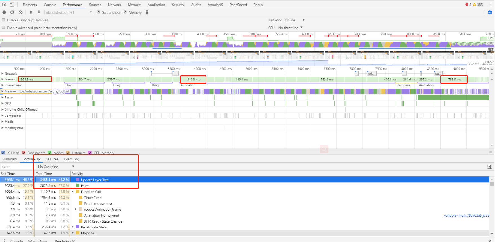
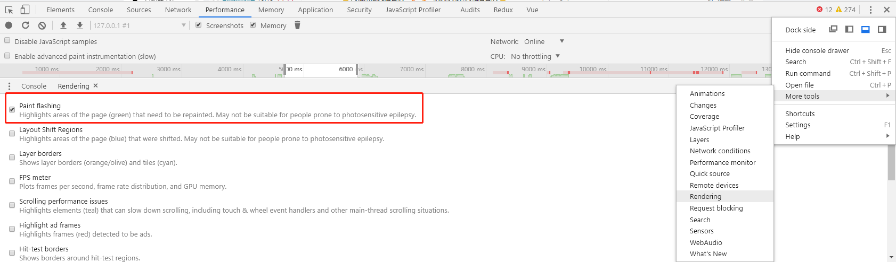
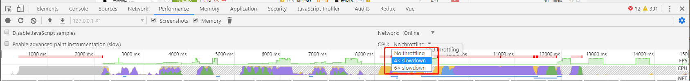

# 两句css 搞定页面滚动时的卡顿问题
```
由于业务要求需要长列表渲染(不能做动态加载和虚拟列表)，
列表数据过多时滚动条的scrollTop达到5w+ ,
同时页面中的一些元素通过websocket实时更新。
在首屏加载、页面滚动、筛选等交互时，页面发生比较严重的卡顿问题
```
## 首先着手优化js 相关部分
```
1. 筛选部分服务端渲染，
2. 低频使用的隐藏元素全部v-if ,
3.  列表元素标签尽可能减少,
4.  部分交互方法优化，部分jquery 原生化 ，
5.  Vue computed 中高频触发的方法写到vuex中按需触发(服务端渲染时也需要使用)
```
优化过后整体性能有所提升，但是当列表数量较多时，滚动列表还是能感受到明显的卡顿。

---

## 两句css 搞定页面滚动时的卡顿问题

其实页面卡顿就是一种用户体验，怎样评判这种体验的好坏了，根据`FPS(frame per 
second)`，即一秒之间能够完成多少次重新渲染，显示器的刷新频率一般是60Hz(在 
   电脑的显示设置中可查)，浏览器会自动按照这个频率刷新动画。每帧渲染的时间不能超过16.66ms(1000ms/60), 在实际开发中30fps-60fps 页面都会比较流畅。

下面通过 `chrome devtool` 排查卡顿问题，在`Performance` 面板记录了操作10s 的耗时：




在浏览器中通过 frames可以非常清晰的看到每帧的用时，用时最长的一帧将近**1s(远大于16.67ms)**。

如上图，`update layer tree`和`Paint` 占用了71.2%的时间， 这个是啥？为什么会这么耗时了？从字面上看意思是更新层树和绘制，实际上就是我们前端程序猿耳熟能详的重排和重绘。

> **`非常需要注意的一点是：一个元素的重排通常会带来一系列的反应，甚至触发整个文档所有元素的重排和重绘，性能代价是非常高昂的。`**

如何查看元素是否有连锁的重绘？如何避免了？

我们可以通过如下设置后操作页面，重绘的区域有绿色边框高亮显示。



经过排查后发现主要有两种情况会引起页面的连锁重绘和重排，导致该页面滚动时卡顿：

```
case1: box-shadow的阴影区域和固定定位有交叉关系时。
```
如左侧导航是固定定位，右侧是列表部分，列表的外层元素添加了box-shadow，
其阴影区域和固定定位有交叉时。滚动时固定定位会触发重绘，通过box-shadow，
间接的使右侧列表上所有元素都发生了重绘。

`修复：去掉该box-shadow属性后滚动列表非常顺畅。`


```
case2: websocket实时更新列表中某行中某个元素的数据时，整个列表发生重绘。
```
解决这个问题，要先了解web页面的层次问题。

有两个因素造成了这个问题，其一是因为数据变化时使用了animation导致了同一层次的元素重绘

`修复方案一：删除该animation属性（因业务要求不可以取）`

`修复方案二：在该元素上增加相对定位，设置一个唯一的z-index值。使元素有独立的层次，在浏览器渲染该元素时不会触发连锁重绘。`


在问题排查中可以通过如下设置降低CPU的速度测试问题：




>`总之在开发过程中严谨的把控好自己的每一行代码，在面对复杂的问题时，多分析和查阅资料，当遇到性能瓶颈问题时，可以多用chrome devtool上的相关设置进行快速定位。`


<Vssue title="vssue-blog" />